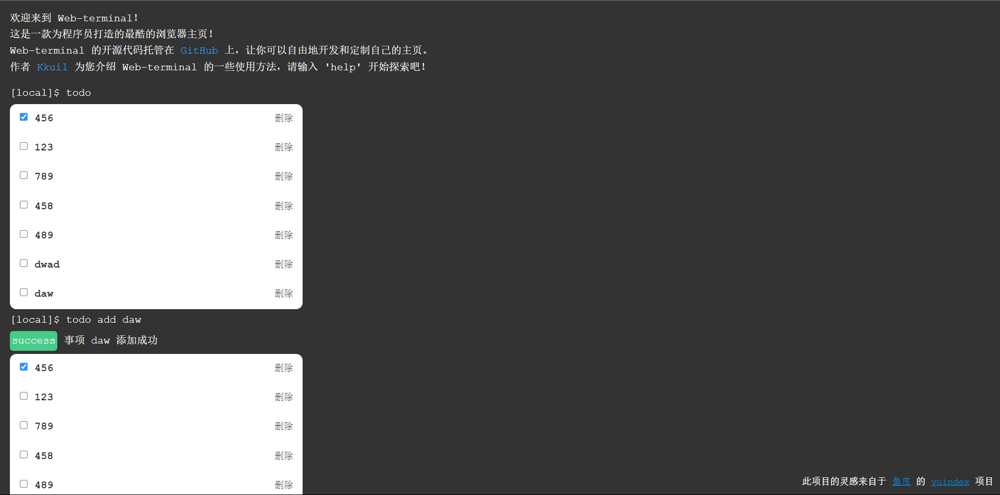
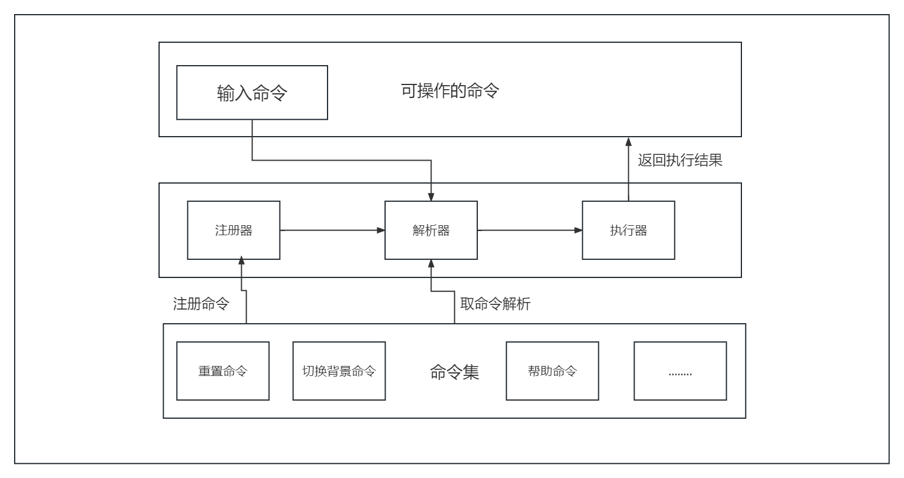

# Web-terminal - 一款专门为程序员所打造的Web终端项目
## 线上体验地址：https://www.kkuil.site
## 项目部分效果图:



## 项目架构图：


## 前端：
* Vue 3.0
* pinia
* vue-router
* tailwindcss 3.0

## 后端
* nodejs
* express

## 依赖库
* axios
* momentjs
* lodash

# 问题：

## 1. 如何启动项目？
### 1.1 拉代码
```cmd
git pull https://github.com/Kkuil/web-terminal.git
```
### 1.2 启动前端项目
```cmd
cd web-terminal
npm run dev
```
### 1.3 启动后端项目
```cmd
cd ..
cd web-server
npm run start
```

## 2. 什么是Web-terminal?
Web-terminal是一款专为程序员所打造的可以在浏览器进行命令交互的网页App，他可以让程序员释放双手

## 3. 为什么做这个项目？
(1) 首先就是这种Web终端项目对于不管是刚入门前端还是已经入门的前端程序员来说，都是一个不错的练手项目，在这个项目中，你不仅可以锻炼你自己的项目开发水平，同时还能训练你的项目架构能力<br/>
(2) 这种Web终端项目在市场上的占有率比较少，所以可以自己拿来进行一番魔改，然后归属于自己个人使用<br/>
(3) 简历加分。正是因为现在这种就业情形，市场更需要的不是千篇一律的后台管理和CRUD项目，更多的是自己的创新与新颖的项目开发思维

## 4. 学习这个项目需要哪些前置知识？
1. 熟悉前端三件套（html + css + javascript）
2. 熟悉axios
3. 了解vue3基本语法及语法糖
4. nodejs基础知识
5. express框架（若学过其他类似的nodejs框架也行，例如：koa或egg）

## 5. 如何添加新功能（新命令）
1. 在core文件夹中新建一个功能文件夹，例如：music
2. 在music文件夹中新建一个musicCommand.(js/ts)文件，这个文件就是你的功能文件
3. 具体如何进行命令编写，请按照以下格式进行编写
```typescript
    // 主命令
    main: string
    // 命令名称
    name: string
    // 命令描述
    desc?: string
    // 命令简写
    alias?: string[]
    // 参数配置
    params?: CommandParamsType[]
    // 选项配置
    options?: CommandOptionsType[]
    // 子命令
    subCommands?: Record<string, ICommandType>
    // 执行功能
    action: ({ params, options }?: CommandActionParamsType) => WebTerminal.OutputType | {} | Promise<WebTerminal.OutputType | {}>
    // 结果是否允许折叠
    collapsible?: boolean
```